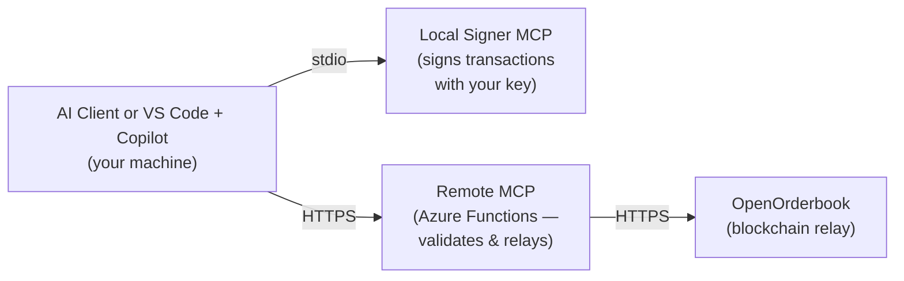

# OpenOrderbook MCP — Fixed-Return Options Trading via AI

Trade fixed-return options (FROs) using AI. This repository ships two ways to interact with the OpenOrderbook platform:

| | **Standalone AI Client** | **VS Code + Copilot** |
|---|---|---|
| **What it is** | Terminal-based conversational trading REPL | AI assistant embedded in your code editor |
| **Best for** | Traders who want a simple chat interface | Developers who want AI inside their IDE |
| **Setup** | Run the binary, answer the wizard | Configure MCP servers, open folder in VS Code |
| **Binaries** | `openorderbook-ai` + `OpenOrderbookSignerMcp` | `OpenOrderbookSignerMcp` only |

Both approaches use the same two-server signing architecture — your key never leaves your machine.

## How It Works



- **Local Signer MCP** — runs on your machine, holds your private key, signs transactions locally. Your key never leaves your device.
- **Remote MCP** — hosted on Azure, validates signatures server-side, relays signed transactions to the OpenOrderbook blockchain relay.
- **AI client / Copilot** — orchestrates the workflow: sign locally → submit remotely → poll for confirmation.

## Option A — Standalone AI Client (Recommended for Traders)

A self-contained terminal application. No VS Code or Copilot subscription required — bring your own Anthropic API key or run a local Ollama model.

### Quick Start

1. **Clone this repository** (you need a GHE account — see [SETUP-MAC-AI-CLIENT.md](docs/SETUP-MAC-AI-CLIENT.md) for PAT instructions):
   ```bash
   git clone https://horizonfintex.ghe.com/horizon/openorderbook-mcp.git
   cd openorderbook-mcp
   ```

2. **macOS only** — make binaries executable:
   ```bash
   # Apple Silicon:
   chmod +x releases/osx-arm64/openorderbook-ai releases/osx-arm64/OpenOrderbookSignerMcp
   xattr -d com.apple.quarantine releases/osx-arm64/openorderbook-ai releases/osx-arm64/OpenOrderbookSignerMcp
   ```

3. **Run the AI client** — the setup wizard launches on first run:
   ```bash
   # Apple Silicon:
   ./releases/osx-arm64/openorderbook-ai

   # Intel Mac:
   ./releases/osx-x64/openorderbook-ai

   # Windows:
   .\releases\win-x64\openorderbook-ai.exe

   # Linux:
   ./releases/linux-x64/openorderbook-ai
   ```

4. **Answer the wizard** — provide your AI provider, keystore path, password, and Azure AD credentials. Config is saved to `~/.openorderbook-ai/config.json`.

5. **Verify** — type in the REPL:
   ```
   > check signer status
   > what's my balance?
   ```

**Full setup guide:** [SETUP-MAC-AI-CLIENT.md](docs/SETUP-MAC-AI-CLIENT.md)

---

## Option B — VS Code + GitHub Copilot

For developers already using VS Code. Requires a [GitHub Copilot](https://github.com/features/copilot) subscription.

### Quick Start

1. **Clone this repository:**
   ```bash
   git clone https://horizonfintex.ghe.com/horizon/openorderbook-mcp.git
   ```

2. **Open the folder in VS Code** — Copilot picks up the [trading skill file](docs/SKILL.md) automatically:
   - **File → Open Folder…** → select `openorderbook-mcp`

3. **macOS only** — make the signer binary executable:
   ```bash
   chmod +x releases/osx-arm64/OpenOrderbookSignerMcp
   xattr -d com.apple.quarantine releases/osx-arm64/OpenOrderbookSignerMcp
   ```

4. **Configure MCP** — copy the template and fill in your credentials:

   **macOS / Linux:**
   ```bash
   mkdir -p .vscode
   cp config/mcp.json.template .vscode/mcp.json
   ```
   **Windows (PowerShell):**
   ```powershell
   New-Item -ItemType Directory -Path .vscode -Force
   Copy-Item config\mcp.json.template .vscode\mcp.json
   ```
   Edit `.vscode/mcp.json`: set `command` to the full path of your platform's `OpenOrderbookSignerMcp` binary, and fill in keystore path, password, and client secret.

   > **Windows:** Use double backslashes in JSON paths (e.g. `C:\\dev\\...`). See [SETUP-WINDOWS.md](docs/SETUP-WINDOWS.md).

5. **Start the MCP servers** — reload VS Code (`Ctrl+Shift+P` → "Developer: Reload Window"), open the MCP panel, start **fro-local-signer** and **fro-uat**.

6. **Verify** — ask Copilot: *"Check signer status"*

**Full setup guides:** [SETUP-MACOS.md](docs/SETUP-MACOS.md) · [SETUP-WINDOWS.md](docs/SETUP-WINDOWS.md)

---

## What You Can Do

Once set up (either option), ask the AI to:

- **Browse the market**: "Show me all open FRO offers" or "Get offers for AAPL"
- **Write an offer**: "Create a Yes offer on AAPL at strike $200, premium $5, 10 contracts"
- **Purchase**: "Buy 5 contracts from offer #42"
- **Check your portfolio**: "Show my portfolio"
- **Exercise positions**: "Exercise position #7"
- **Secondary market**: "List position #3 for sale at $50" or "Buy position #3 from secondary"
- **Track transactions**: "Check status of tracking ID abc-123"

The AI handles the full sign → submit → confirm workflow automatically.

## Documentation

| Document | Description |
|----------|-------------|
| [SETUP-MAC-AI-CLIENT.md](docs/SETUP-MAC-AI-CLIENT.md) | macOS setup for the standalone AI client (PAT, wizard, profiles) |
| [SETUP-MACOS.md](docs/SETUP-MACOS.md) | macOS setup for VS Code + Copilot |
| [SETUP-WINDOWS.md](docs/SETUP-WINDOWS.md) | Windows setup for VS Code + Copilot |
| [ARCHITECTURE.md](docs/ARCHITECTURE.md) | Two-server model, signing flow, security design |
| [TOOLS-REFERENCE.md](docs/TOOLS-REFERENCE.md) | Complete reference for all local + remote MCP tools |
| [SKILL.md](docs/SKILL.md) | AI skill file — trading workflows, parameter formats, error handling |

## Repository Structure

```
releases/
  osx-arm64/        openorderbook-ai  OpenOrderbookSignerMcp  (Apple Silicon)
  osx-x64/          openorderbook-ai  OpenOrderbookSignerMcp  (Intel Mac)
  win-x64/          openorderbook-ai.exe  OpenOrderbookSignerMcp.exe
  linux-x64/        openorderbook-ai  OpenOrderbookSignerMcp
config/
  mcp.json.template                   MCP server config template for VS Code
docs/                                 Setup guides and reference documentation
src/
  Abbey.Ethereum/                     Ethereum signing library (source)
```

## Prerequisites

- An Ethereum keystore file (V3 JSON format) — your team lead will provide one
- Azure AD client credentials — provided by your administrator
- **AI client:** Anthropic API key (`sk-ant-...`) from [console.anthropic.com](https://console.anthropic.com), or a local Ollama instance
- **VS Code + Copilot:** [VS Code](https://code.visualstudio.com/) with a [GitHub Copilot](https://github.com/features/copilot) subscription
- Azure AD B2C client credentials — your team lead will provide these

## Project Structure

```
openorderbook-mcp/
├── .github/
│   └── copilot-instructions.md  # Auto-loaded rules for Copilot
├── config/
│   └── mcp.json.template        # MCP config template (copy to .vscode/mcp.json)
├── docs/
│   ├── ARCHITECTURE.md           # Architecture & security design
│   ├── SETUP-MACOS.md            # macOS setup guide
│   ├── SETUP-WINDOWS.md          # Windows setup guide
│   ├── SKILL.md                  # AI skill file for Copilot
│   └── TOOLS-REFERENCE.md        # All MCP tools reference
└── releases/                     # Pre-built self-contained binaries
    ├── osx-arm64/                # Apple Silicon (M1/M2/M3/M4)
    ├── osx-x64/                  # Intel Mac
    ├── win-x64/                  # Windows
    └── linux-x64/                # Linux
```

## Security Model

- **Private keys never leave your machine** — all signing happens in the local signer MCP process
- **Server-side signature verification** — the remote MCP validates every signature before relaying to the blockchain
- **Bearer token auth** — all remote MCP calls require a valid Azure AD B2C token
- **No secrets in repo** — credentials are configured via environment variables only

## License

Proprietary — Horizon Fintex. All rights reserved.
