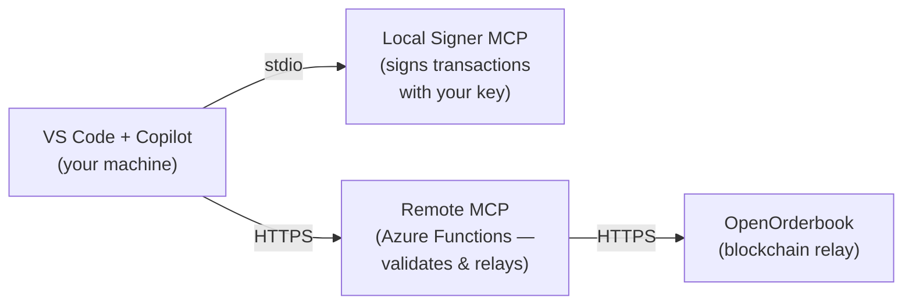

# OpenOrderbook MCP — Fixed-Return Options Trading via AI

Trade fixed-return options (FROs) directly from VS Code using GitHub Copilot and the [Model Context Protocol (MCP)](https://modelcontextprotocol.io/).

## How It Works



- **Local Signer MCP** — runs on your machine, holds your private key, signs transactions locally. Your key never leaves your device.
- **Remote MCP** — hosted on Azure, validates signatures server-side, relays signed transactions to the OpenOrderbook blockchain relay.
- **Copilot** — orchestrates the workflow: sign locally → submit remotely → poll for confirmation.

## Quick Start

1. **Clone or download** this repository:
   ```bash
   git clone https://github.com/HorizonFintex/openorderbook-mcp.git
   ```

2. **Open the repo in VS Code** — use the cloned repo as your workspace so Copilot has access to all the documentation and the [trading skill file](docs/SKILL.md):

   1. Launch VS Code
   2. Go to **File → Open Folder…**
   3. Select the `openorderbook-mcp` folder and click **Open**

3. **macOS only** — make the binary executable and remove Gatekeeper quarantine:
   ```bash
   # Apple Silicon (M1/M2/M3/M4):
   chmod +x /path/to/openorderbook-mcp/releases/osx-arm64/OpenOrderbookSignerMcp
   xattr -d com.apple.quarantine /path/to/openorderbook-mcp/releases/osx-arm64/OpenOrderbookSignerMcp
   ```

4. **Configure** — create the `.vscode` folder and copy the template:

   **macOS / Linux:**
   ```bash
   cd ~/openorderbook-mcp   # or wherever you cloned the repo
   mkdir -p .vscode
   cp config/mcp.json.template .vscode/mcp.json
   ```
   **Windows (PowerShell):**
   ```powershell
   cd C:\dev\openorderbook-mcp   # or wherever you cloned the repo
   New-Item -ItemType Directory -Path .vscode -Force
   Copy-Item config\mcp.json.template .vscode\mcp.json
   ```
   Edit `.vscode/mcp.json` **inside VS Code** (not an external editor): set the `command` to the full path to your platform's binary, and fill in your keystore path, password, and client secret.

   > **Windows:** All paths in JSON must use double backslashes (e.g. `C:\\dev\\...`). See the [Windows Setup Guide](docs/SETUP-WINDOWS.md) for a complete example.

5. **Start the MCP servers** — after reloading VS Code (`Ctrl+Shift+P` → "Developer: Reload Window"), open the MCP servers panel. You should see both **fro-local-signer** and **fro-uat** listed. Click **Start** on each server and wait until both show a **Running** status before proceeding.

6. **Verify** — ask Copilot:
   > "Check signer status"

   You should see your wallet address and environment.

For detailed setup instructions, see:
- [macOS Setup Guide](docs/SETUP-MACOS.md)
- [Windows Setup Guide](docs/SETUP-WINDOWS.md)

## Documentation

| Document | Description |
|----------|-------------|
| [SETUP-MACOS.md](docs/SETUP-MACOS.md) | Detailed macOS installation and configuration |
| [SETUP-WINDOWS.md](docs/SETUP-WINDOWS.md) | Detailed Windows installation and configuration |
| [ARCHITECTURE.md](docs/ARCHITECTURE.md) | Two-server model, signing flow, security design |
| [TOOLS-REFERENCE.md](docs/TOOLS-REFERENCE.md) | Complete reference for all local + remote MCP tools |
| [SKILL.md](docs/SKILL.md) | AI skill file — teaches Copilot how to use the trading tools |

## AI-Assisted Onboarding

This repository includes a [SKILL.md](docs/SKILL.md) file that teaches GitHub Copilot the complete FRO trading workflow — parameter formats, signing sequences, error handling, and best practices. When you open this repo as your VS Code workspace, Copilot can read these docs and guide you through trading step by step.

For the best experience, ensure you have [GitHub Copilot](https://github.com/features/copilot) installed in VS Code before you start.

## What You Can Do

Once set up, you can ask Copilot to:

- **Browse the market**: "Show me all open FRO offers" or "Get offers for AAPL"
- **Write an offer**: "Create a Yes offer on AAPL at strike $200, premium $5, 10 contracts"
- **Purchase**: "Buy 5 contracts from offer #42"
- **Check your portfolio**: "Show my portfolio for 0x34ad..."
- **Exercise positions**: "Exercise position #7"
- **Secondary market**: "List position #3 for sale at $50" or "Buy position #3 from secondary"
- **Track transactions**: "Check status of tracking ID abc-123..."

Copilot handles the full sign → submit → confirm workflow automatically.

## Prerequisites

- [VS Code](https://code.visualstudio.com/) with [GitHub Copilot](https://github.com/features/copilot)
- An Ethereum keystore file (V3 JSON format) — your team lead will provide one
- Azure AD B2C client credentials — your team lead will provide these

## Project Structure

```
openorderbook-mcp/
├── .github/
│   └── copilot-instructions.md  # Auto-loaded rules for Copilot
├── config/
│   └── mcp.json.template        # MCP config template (copy to .vscode/mcp.json)
├── docs/
│   ├── ARCHITECTURE.md           # Architecture & security design
│   ├── SETUP-MACOS.md            # macOS setup guide
│   ├── SETUP-WINDOWS.md          # Windows setup guide
│   ├── SKILL.md                  # AI skill file for Copilot
│   └── TOOLS-REFERENCE.md        # All MCP tools reference
└── releases/                     # Pre-built self-contained binaries
    ├── osx-arm64/                # Apple Silicon (M1/M2/M3/M4)
    ├── osx-x64/                  # Intel Mac
    ├── win-x64/                  # Windows
    └── linux-x64/                # Linux
```

## Security Model

- **Private keys never leave your machine** — all signing happens in the local signer MCP process
- **Server-side signature verification** — the remote MCP validates every signature before relaying to the blockchain
- **Bearer token auth** — all remote MCP calls require a valid Azure AD B2C token
- **No secrets in repo** — credentials are configured via environment variables only

## License

Proprietary — Horizon Fintex. All rights reserved.
